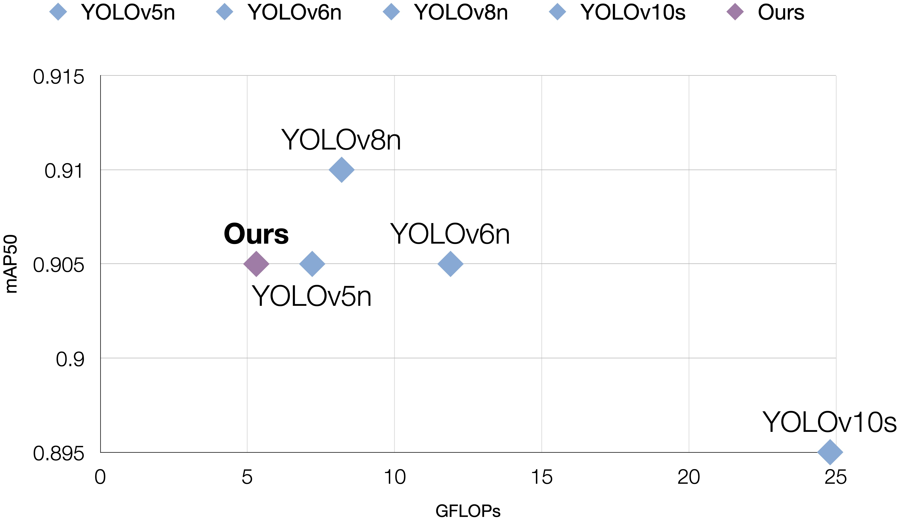
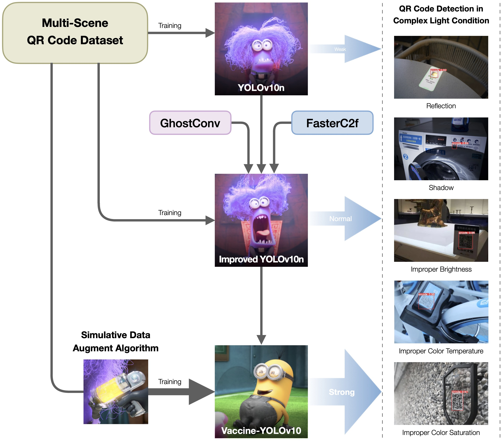

<div align="center">
<h1>Vaccine-YOLOv10: real-time QR code detection model for complex light condition</h1>

<p>
   <a href="https://link.springer.com/article/10.1007/s11554-025-01631-z"></a>
   <a href="https://link.springer.com/article/10.1007/s11554-025-01631-z"></a>
   <a href="LICENSE"></a>
</p>

[Xiaobei Zhao](https://github.com/AlexTraveling) · [Xiang Li](https://faculty.cau.edu.cn/lx_7543/)<sup>✉️</sup>

**[China Agricultural University](https://ciee.cau.edu.cn)**

xiaobeizhao2002@163.com, cqlixiang@cau.edu.cn

<!-- <sup>✉️</sup> Corresponding Authors -->


</div>

<!-- > MDE-AgriVLN v.s. Human and Baseline on a representative episode. In every method's section, the right images are the visual inputs at the time step $t = 6.2s$ (marked by the white arrows), the bottom textbox is the reasoning result at the same time step, and the top textbox is the evaluation result. Underline marks the pivotal reasoning thoughts. -->

## Updates
- [March 11th, 2025] We publish the paper 'Vaccine-YOLOv10: real-time QR code detection model for complex light condition' on Journal of Real-Time Image Processing, which is available for reading on the [official Springer homepage](https://link.springer.com/article/10.1007/s11554-025-01631-z).
- [January 13th, 2025] Congratulations to us! The paper 'Vaccine-YOLOv10: real-time QR code detection model for complex light condition' is accepted for publishing on Journal of Real-Time Image Processing. 
- [December 7th, 2024] We open-source the complete codes of Vaccine-YOLOv10.

## Overview
QR code is not only an information storage approach, but also a spatial localization sign. Compared to other spatial localization signs, QR code is more accurate and more efficient to be detected. To achieve spatial localization by QR code, detection is the essential procedure. Existing approaches perform well in regular light condition, however, preform badly in complex light condition, because frame quality is extremely damaged by complex light condition. In the real world, complex light condition is very common but always unavoidable. Therefore, it is necessary and worthwhile to improve the under-complex-light QR code detection.

In this paper, we propose Vaccine-YOLOv10 (VCY) to enhance QR code detection capability in complex light condition. First, GhostConv and FasterC2f are introduced to replace the corresponding original modules of YOLOv10n. Second, Simulative Data Augment Algorithm (SDA) is proposed to simulate 5 types of complex light condition. Third, self-built Multi-Scene QR Code Dataset (MSQ) is augmented by SDA for VCY training. Compared to the baseline model YOLOv10n, VCY is improved on both lightweight and accuracy. Specifically, FPS reaches to 150; GFLOPs reduces from 8.2 to 5.3; mAP50 increases from 0.877 to 0.905.



## Citation
If our paper or method is helpful for your research, welcome you use the following citation:
```bibtex
@inproceedings{Vaccine-YOLOv10,
  title={Vaccine-YOLOv10: real-time QR code detection model for complex light condition},
  author={Xiaobei Zhao and Xiang Li},
  booktitle={Journal of Real-Time Image Processing},
  year={2025}
}
```
